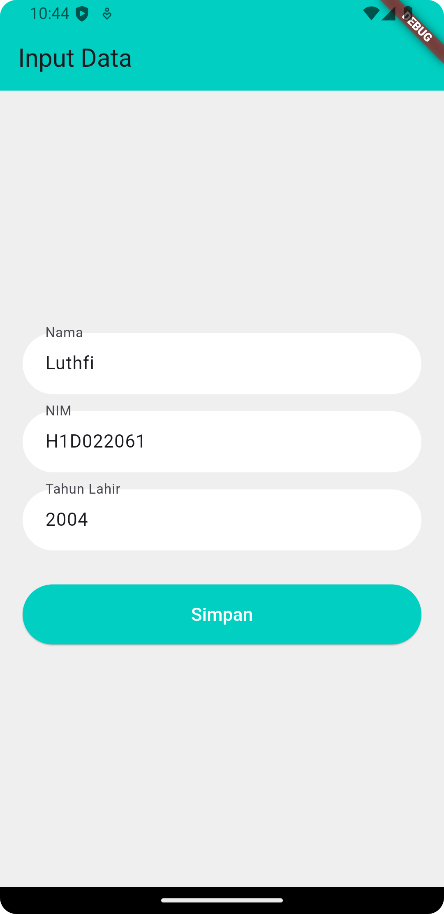
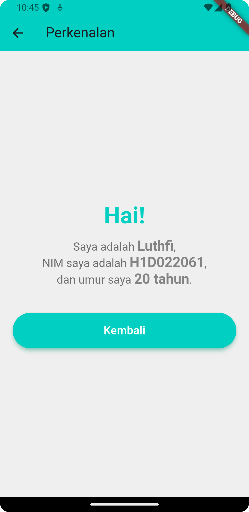

# Tugas Pertemuan 2

- **Nama** : Luthfi Arie Zulfikri
- **NIM** : H1D022061
- **Shift Lama** : A
- **Shift Baru** : A

---

## Proses Passing Data dari Form Menuju Tampilan

- Form terdiri dari beberapa widget `TextField` yang digunakan untuk mengambil input dari pengguna, yaitu **nama**, **NIM**, dan **tahun lahir**. Data dari setiap `TextField` disimpan dalam variabel yang diakses melalui `TextEditingController`.
- Ketika tombol "Simpan" ditekan, data dari controller (`_namaController`, `_nimController`, `_tahunController`) diambil dan disimpan dalam variabel lokal di dalam fungsi tersebut.

- Setelah data dari form diambil, aplikasi menggunakan `Navigator.push()` untuk berpindah dari halaman form ke halaman lain (misalnya, halaman **TampilData**). Pada tahap ini, data dari form dikirimkan sebagai parameter ke halaman tujuan.

- Halaman tujuan (**TampilData**) menerima data melalui constructor. Tiga parameter (nama, nim, dan tahun) diteruskan dari form dan disimpan sebagai variabel `final` di dalam kelas **TampilData**.

- Setelah data diterima, halaman **TampilData** akan menggunakan data tersebut untuk menampilkan informasi pengguna.

---

## Screenshot

